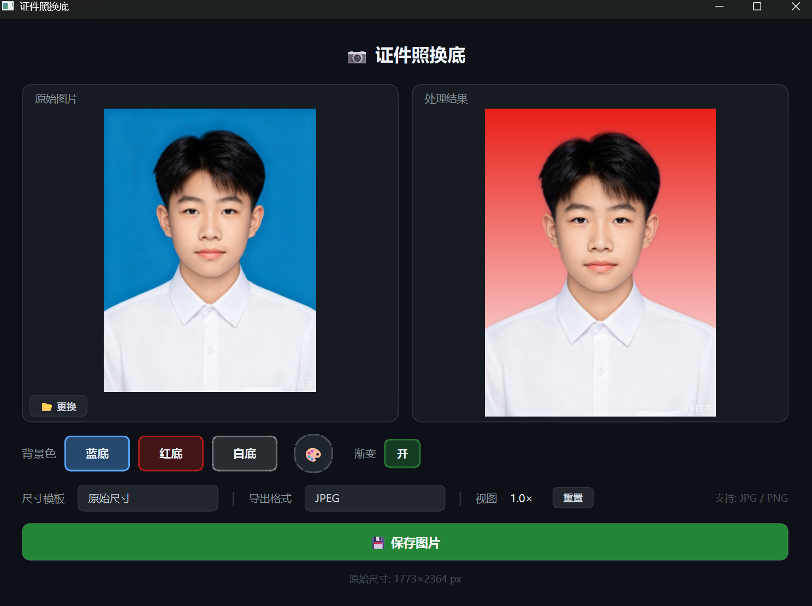

# 证件照背景替换

将纯色背景证件照替换为蓝/红/白标准背景，原图分辨率无损输出。

## 模型方案

| 模型 | 大小 | 推理速度 | 效果 |
|------|------|---------|------|
| **MODNet** | 24.7 MB | ~2s/张 | ✅ 轻量，头发细节好 |

> ~~RMBG-2.0 (977MB) 效果也好但太重，已删除。~~

## 处理流程

```
输入图片 (任意分辨率)
    │
    ▼
MODNet 512×512 推理 → alpha mask → resize 回原分辨率
    │
    ▼
色彩去污染 (从过渡区像素中洗掉原始背景色)
    │
    ▼
Erosion (3×3) × 3轮 → 消除边缘白边
    │
    ▼
Alpha blending: result = fg × α + bg_color × (1-α)
    │
    ▼
PNG 无损输出 (原分辨率)
```

### 为什么这样设计

- **色彩去污染**: 治本。原始背景(白)渗入过渡区像素，换底后产生白边；去污染从数学上反解出真实前景色。
- **Erosion × 3**: 治标。轻微收缩 mask 边缘，双重保障消除残余白边。
- **Guided Filter / Gaussian Blur**: 测试后确认无效果，已删除。

## 使用方法

```python
from bg_remover import process_image

# 蓝底
process_image("photo.jpg", "blue")

# 红底
process_image("photo.jpg", "red")

# 白底
process_image("photo.jpg", "white")

# 指定输出路径
process_image("photo.jpg", "blue", output_path="result.png")

# 跳过 Erosion（调试用）
process_image("photo.jpg", "blue", erode_iters=0)
```

## 参数调优记录

消融实验结论（蓝底，test_avatar.jpg 2809×4257）：

| 优化 | 单独效果 | 结论 |
|------|---------|------|
| 无优化 | 白边明显 | baseline |
| Guided Filter | 无改善 | ❌ 删除 |
| 色彩去污染 | 白边基本消失 | ✅ 核心 |
| Erosion-only | 白边减少 | 辅助 |
| Gaussian Blur | 效果不明显 | ❌ 删除 |

Erosion 轮次对比（结合去污染）：

| 轮次 | 边缘质量 | 结论 |
|------|---------|------|
| 0 | 白边残留 | — |
| 1-2 | 白边减少 | 有效 |
| **3** | **最佳平衡** | ✅ 选用 |
| 4-5 | 人物变瘦 | 过量 |

## 示例效果



## 文件结构

```
id-photo-bg/
├── app.py            # PyQt6 主程序入口
├── bg_remover.py     # 核心逻辑 (~100行)
└── README.md
```

## 后续计划

- [ ] Gradio Web UI（拖拽上传+在线预览）
- [ ] 批量处理
- [ ] FastAPI 后端（微信小程序集成）
